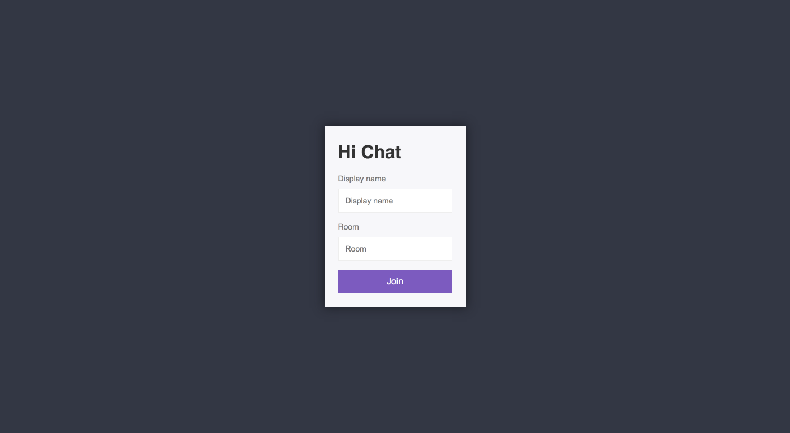
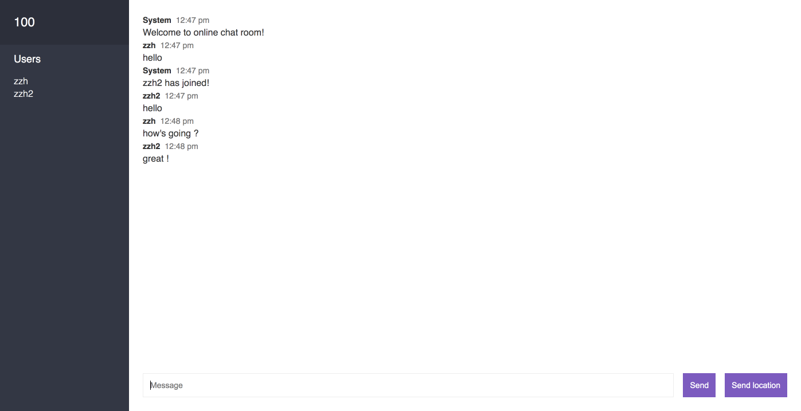

This is an simple online chat room
This sample application uses the Express framework and Bootstrap to build a simple, scalable online chat room that is deployed to AWS Elastic Beanstalk.

**Online demo:**

1.The screenshot of the project

